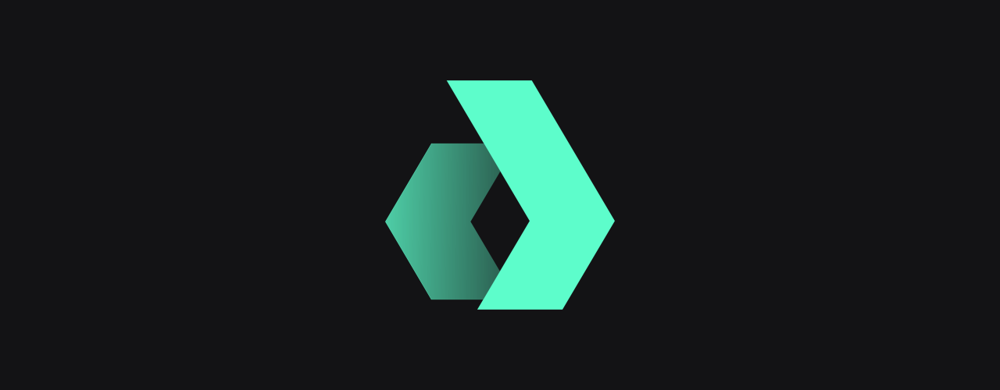

<h1 align="center">DAOBox - use-aragon</h1>

<p align="center">
    
    <br>
    <i>DAOBox - use-aragon is a library of react hooks that enables seamless creation of <br>
    frontends on AragonOSx for React developers.</i>
    <br>
</p>

<p align="center">
  <a href="https://use-aragon.daobox.app">Doc</a>
  •
  <a href="https://discord.gg/EWRMHjqQVf">DAOBox: DAO Development Discord</a>
  <br>
</p>
<hr>

## Apps and Packages

- `apps/docs`: `use-aragon` documentation site powered by [Next.js](https://nextjs.org/)
- `apps/example`: sample of applied `use-aragon` hooks.
- `packages/daobox-use-aragon`: core library of aragon hooks.

Each package and app is 100% [TypeScript](https://www.typescriptlang.org/).

## Development Setup

- [Contributing Guidelines](docs/CONTRIBUTING.md)

### Prerequisites

- Install [Node.js 16.x](https://nodejs.org/en/) which includes [Node Package Manager](https://docs.npmjs.com/getting-started)
- Install [pnpm 7.x](https://pnpm.io/installation)

### Running on Localhost

``` bash
pnpm install
pnpm dev
```